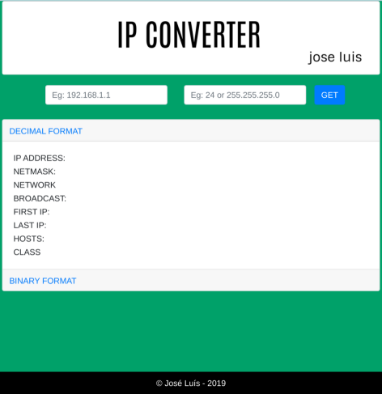

# IP-CONVERTOR
A small app to calculate subnets, and convert ip addresses built in flask.

[See it in action](https://ipconvertor.com)

## Examples



## Contribute
```pip install -r requirements.tx```

## Features
- [x] Decimal format.
- [x] Binary format.
- [ ] Octal format
- [ ] Hexadecimal format.
- [ ] Subnet Calc.
- [x] Api Rest.
- [ ] Apply Unit Tests.
